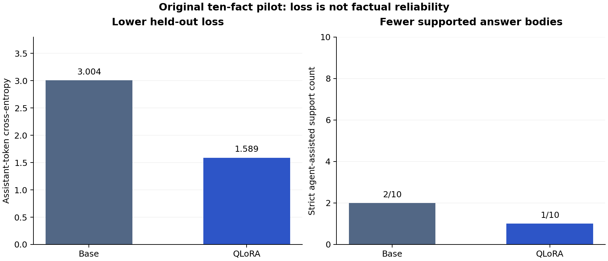
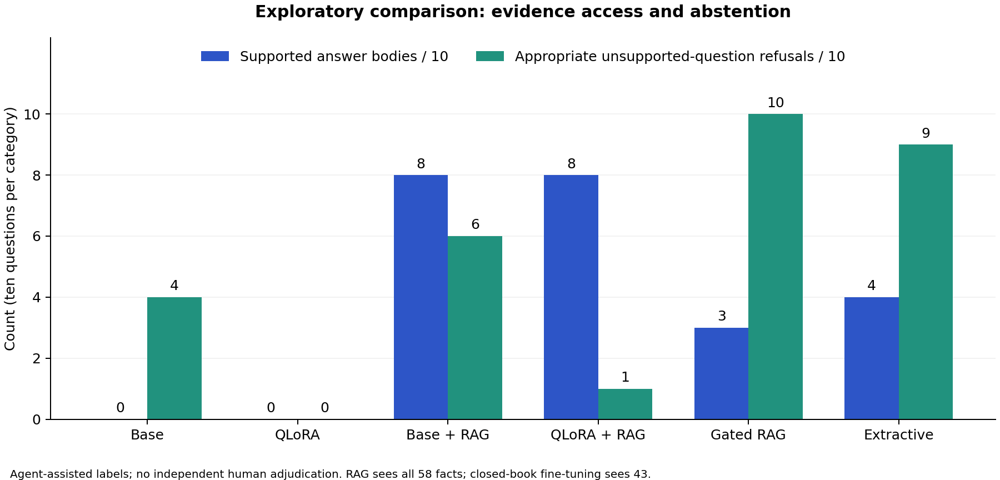
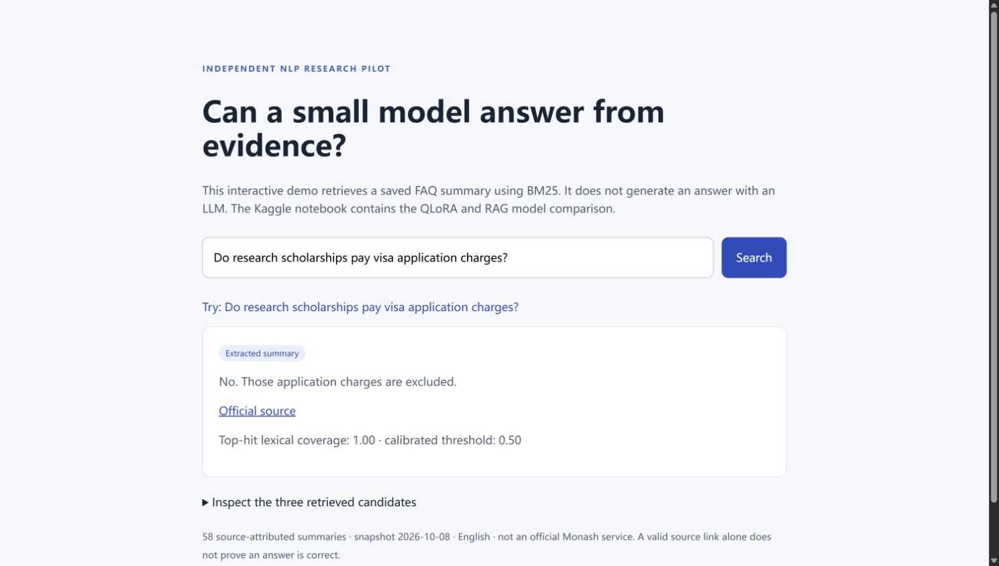

# Monash FAQ: QLoRA, Retrieval, and Factual Reliability

**A reproducible NLP research pilot investigating why lower fine-tuning loss can coexist with unreliable factual answers.**

This project adapts Qwen2.5-1.5B-Instruct to a small source-attributed university FAQ dataset, then compares closed-book answering with retrieval-assisted answering and abstention. It includes executable Kaggle notebooks, fixed fact-level splits, raw predictions, a published evaluation protocol, error analysis, integrity checks, and a lightweight local demo.

The original QLoRA run lowered held-out assistant-token loss from **3.0037 to 1.5889**, yet strict agent-assisted review supported only **1/10** adapter answers compared with **2/10** base answers. The goal is to study that failure openly and test whether access to evidence helps.



The follow-up Kaggle experiment produced 80 model responses and 40 derived baseline outputs. On ten answerable paraphrases, both RAG configurations had **8/10** fully supported answer bodies. On ten unsupported questions, base+RAG had **6/10** appropriate explicit refusals and adapter+RAG had **1/10**. The calibrated gated system refused all ten unsupported questions, while also refusing five answerable questions. These are strict agent-assisted judgments on a tiny convenience set, not production accuracy.



## Explore the research

| Artifact | What it demonstrates |
| --- | --- |
| [Experimental protocol](docs/PROTOCOL.md) | Research questions, controls, information-access differences, metrics, and limitations |
| [Research report](docs/REPORT.md) | Results, concrete failures, and interpretation |
| [Training notebook](notebooks/01_qlora_training.ipynb) | NF4 QLoRA, assistant-only loss, validation selection, adapter export/reload |
| [Comparison notebook](notebooks/02_research_comparison.ipynb) | Base, QLoRA, base+RAG, QLoRA+RAG, gated RAG, and extractive baseline |
| [Dataset card](docs/DATA_CARD.md) / [model card](docs/MODEL_CARD.md) | Source provenance, intended use, and known limitations |
| [Raw pilot results](results/pilot) / [comparison results](results/comparison) | Inspectable outputs and reviewer labels |
| [Review rubric](docs/REVIEW_RUBRIC.md) | How factual support and unsupported-question refusals are judged |
| [Application notes](docs/PORTFOLIO.md) | Defensible CV wording and interview discussion points |

## Reproduce on Kaggle

[Release downloads](https://github.com/elevate007/monash-faq-research/releases) include the original pilot adapter bundle, the unmodified comparison-results export, and a repository snapshot. The original pilot adapter and the follow-up retraining are distinguished in the release notes; no base-model weights are redistributed.

1. Import `notebooks/02_research_comparison.ipynb` into a new Kaggle notebook.
2. Enable Internet and choose a T4 GPU accelerator. The code uses one T4 even when T4 x2 is selected.
3. Save & Run All. The notebook embeds the frozen data and retrieval code; no GitHub token or private data is needed.
4. Download `monash_comparison_results.zip` and `monash_trained_adapter.zip` from the outputs. The comparison notebook retrains and reloads its own adapter before evaluation.
5. Inspect every raw answer and use the review rubric. Automatically computed refusal indicators and source metadata are not factual correctness scores.

The [original pilot run](https://www.kaggle.com/code/syyouroboros/monash-faq-qwen2-5-qlora?scriptVersionId=356260365) and [comparison run](https://www.kaggle.com/code/syyouroboros/monash-faq-qwen2-5-qlora?scriptVersionId=356268791) are recorded for provenance. These Kaggle versions may require owner access; the public repository includes the runnable notebooks and exported research results. Large model/checkpoint weights are not committed to Git.

## Run the CPU checks and demo

Python 3.11+ is sufficient; these commands need no GPU or third-party package:

```bash
git clone https://github.com/elevate007/monash-faq-research.git
cd monash-faq-research
python -m unittest discover -s tests -v
python src/evaluate_retrieval.py
python src/demo.py
```

Open `http://127.0.0.1:8000`. This is an **extractive BM25 demo**, not live LLM generation. It returns a saved summary or abstains and exposes candidate records for inspection.



To regenerate figures, install `matplotlib==3.10.7` and run `python src/plot_results.py`. Training dependencies are pinned in `requirements-training.txt`; the notebook uses Kaggle's CUDA-enabled PyTorch and records the actual runtime versions and resolved model revision. Fully bit-identical reproduction across runtime images is not guaranteed.

## Study design and limits

The dataset contains **58 English paraphrases from 10 official public pages**, with **43/5/10** train/validation/test facts. The follow-up convenience benchmark has **10 answerable test-fact paraphrases and 10 unsupported personal/future questions**. A separate ten-case calibration set selects the retrieval gate. Retrieval sees all 58 facts, including held-out facts, while fine-tuning sees only the 43 training facts. This tests system behavior with different evidence access, not equal-information model learning.

Review labels are agent-assisted, not independent human adjudication. Source pages are shared across fact splits. The RAG and closed-book prompts differ. There is one training seed, a tiny sample, and no production or population-accuracy claim. The source snapshot is dated 2026-10-08 and may become stale. See the protocol for the full interpretation constraints.

## Development provenance and rights

This is a user-directed project developed with substantial AI coding, browser automation, source-curation, and evaluation assistance. The repository preserves the protocol, code, raw artifacts, and review notes so the work can be inspected and reproduced. It is an independent educational project and is not endorsed by Monash University.

MIT applies to original code and authored documentation only. University source content and source-derived data are excluded from that license; their rights and terms remain with the respective sources. Base-model weights retain the upstream license. See [LICENSE](LICENSE) and the dataset card.

## References

- Hu et al., [LoRA: Low-Rank Adaptation of Large Language Models](https://arxiv.org/abs/2106.09685).
- Dettmers et al., [QLoRA: Efficient Finetuning of Quantized LLMs](https://arxiv.org/abs/2305.14314).
- Robertson and Zaragoza, [The Probabilistic Relevance Framework: BM25 and Beyond](https://doi.org/10.1561/1500000019).
- [Qwen2.5-1.5B-Instruct model card](https://huggingface.co/Qwen/Qwen2.5-1.5B-Instruct).
- Official Monash sources are enumerated in [data/sources.json](data/sources.json).
