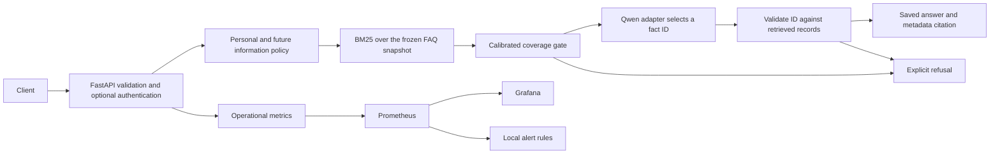

# FastAPI, RAG, and monitoring

The v0.2 service reloads the original trained QLoRA adapter and exposes a versioned API. Its default **grounded** mode performs BM25 retrieval, asks the model to select one supplied fact ID, validates that ID, and returns the exact saved answer and its metadata URL. It does not freely rewrite the answer. Invalid model output, low lexical coverage, unavailable personal information, and post-snapshot years trigger a refusal. This narrows the space for invented facts, while retaining possible wrong selections, incomplete summaries, and stale policies.



## Run the actual model

Use Python 3.11+ from the repository root. Install a suitable PyTorch build for your host, then:

```bash
pip install -r requirements-inference.txt
python src/download_adapter.py
uvicorn service.app:app --host 127.0.0.1 --port 8000 --workers 1 --no-access-log
```

The download helper checks the published adapter ZIP SHA256, rejects unsafe paths, and never overwrites a populated model directory. `FAQ_BACKEND=qwen` is the default. The fixed upstream model revision is `989aa7980e4cf806f80c7fef2b1adb7bc71aa306`. First startup downloads base weights and can take time. CPU inference uses FP32 and needs several GB of RAM; CUDA inference uses NF4 with `bitsandbytes==0.49.2`. Install the appropriate PyTorch/CUDA packages before CUDA startup. A requested CUDA device that is unavailable fails startup. Missing or mismatched adapters also fail startup; there is no silent substitution with a base or extractive model.

Linux/macOS environment examples:

```bash
export FAQ_BACKEND=qwen
export FAQ_DEVICE=auto
export FAQ_RESPONSE_MODE=grounded
```

Windows PowerShell examples:

```powershell
$env:FAQ_BACKEND = "qwen"
$env:FAQ_DEVICE = "cpu"
$env:FAQ_RESPONSE_MODE = "grounded"
python -m uvicorn service.app:app --host 127.0.0.1 --port 8000 --workers 1 --no-access-log
```

`FAQ_ADAPTER_DIR` overrides the adapter directory. `FAQ_CPU_THREADS` defaults to 8. `FAQ_MAX_NEW_TOKENS` defaults to 96 and is limited to 16-256. Use one Uvicorn worker per model instance. Generation is serialized; a concurrent model generation receives HTTP 429 with `Retry-After`. Input validation limits question length and rejects extra fields. There is no hard cancellation of an already running Torch generation; clients should use a suitable request timeout. No external hosting is configured by this repository.

## API contract

| Endpoint | Purpose |
| --- | --- |
| `POST /v1/answer` | Question, optional exact audience string; returns answer/refusal, reason, citations, retrieval signals, model mode, and latency |
| `GET /healthz` | Process liveness |
| `GET /readyz` | Backend readiness and model identity |
| `GET /v1/audiences` | Audience labels available in the snapshot |
| `GET /v1/monitoring` | In-process operational counters and interpretation |
| `GET /metrics` | Prometheus exposition |
| `GET /docs` | Interactive OpenAPI documentation |
| `GET /` | Local question-and-monitoring dashboard |

```bash
curl -X POST http://127.0.0.1:8000/v1/answer \
  -H 'Content-Type: application/json' \
  -d '{"question":"Do research scholarships pay visa application charges?"}'
```

`X-Request-ID` links responses to operational logs. Grounded citations identify the exact returned summary. Generative citations are explicitly marked `candidate_only=true`: they identify retrieved metadata, not proven sentence-level support. `support_check=exact_snapshot_text` establishes that the response is copied from a saved record, not that it answers the user correctly or remains current.

## Three explicit serving modes

- **qwen + grounded**: the actual adapter selects an evidence ID; the server returns that record's saved answer. Default for direct Uvicorn startup.
- **qwen + generative**: set `FAQ_RESPONSE_MODE=generative` to return model prose after refusal, URL, numeric/contact, and lexical-overlap surface checks. These checks can miss contradictions and qualifiers, so this is an experimental mode, not a factual verifier.
- **extractive**: set `FAQ_BACKEND=extractive` for a lightweight top-BM25 summary demo. This does not load an LLM, and responses explicitly report `adapter_loaded=false`. Docker Compose defaults to this inexpensive demo mode.

The service reuses the previously calibrated coverage threshold, 0.50, without retuning on its live benchmark. It additionally blocks explicit personal-information requests and years after 2026. These policies are conservative heuristics and can over-refuse questions. They are changes to system behavior, not additional fine-tuning.

## Monitoring stack

```bash
docker compose up --build
```

Open the API at `http://127.0.0.1:8000`, Prometheus at `http://127.0.0.1:9090`, and the provisioned Grafana viewer at `http://127.0.0.1:3000`. The Compose ports bind to loopback. It provides a 12-panel dashboard, a seven-day metrics store, and alert rules for unavailable backends, answer errors, p95 latency, and repeated invalid outputs. The Docker image is a CPU image. To use the actual model in this stack, download the adapter first and set `FAQ_BACKEND=qwen` in a local `.env`. This will download the base model at startup. Docker installation and container execution are prerequisites; configuration validation alone does not verify a running Grafana/Prometheus deployment.

Prometheus evaluates alert conditions locally. No Alertmanager receiver, email, Slack, or notification destination is configured. Alert thresholds are initial operational defaults, not tuned service-level objectives. Very small traffic cannot support meaningful latency or error-rate estimates; traffic-sensitive alerts require at least twenty requests in five minutes.

| Metric | Interpretation |
| --- | --- |
| `faq_http_requests_total` | Bounded route/method/status counts |
| `faq_http_request_duration_seconds` | HTTP latency histogram |
| `faq_answers_total` | Decisions by backend/mode/outcome/reason |
| `faq_generation_duration_seconds` / `faq_output_tokens_total` | Model work |
| `faq_retrieval_coverage` | Lexical coverage proxy; not confidence |
| `faq_guardrail_blocks_total` | Invalid outputs or conservative policy blocks; not hallucination rate |
| `faq_model_ready` / `faq_inference_inflight` | Availability and generation concurrency |
| `faq_gpu_allocated_bytes` | Torch GPU allocated bytes; zero on CPU |

Counters reset when the API restarts; Prometheus provides retained time series. Metrics and JSON operational logs omit questions, answer bodies, keys, and contact data. No text quality feedback is automatically collected. Measuring factual accuracy or drift requires a separate source-reviewed evaluation set.

For deployments beyond a local demonstration, place the API and monitoring UI behind appropriate authentication and TLS. Optional `FAQ_API_KEY` protects answer, metrics, and monitoring endpoints through `X-API-Key`; health endpoints and documentation remain public. The included local Compose demo leaves that key unset so its internal scraper can read metrics. If enabling it, configure your scraper credentials separately. Do not commit keys or expose the default local Grafana viewer publicly.

## Verification

```bash
pip install -r requirements-api-dev.txt
pytest -q
python src/evaluate_api.py --url http://127.0.0.1:8000
```

The ordinary tests use explicit test doubles for output-validation/error cases and exercise the real extractive backend separately. They do not claim to test Qwen weights. The live evaluation uses the actual HTTP backend and records its model identity, mode, exact target selection, refusals, and metrics. It sends only the question field, never the gold reference or target fact ID. Its twenty cases remain the earlier tiny convenience sample. CPU FP32 serving results are distinct from the previous T4 NF4 generation experiment.

### Recorded local serving result

The real original adapter was loaded on this host with CPU/FP32 inference and served through HTTP. On the twenty frozen cases: four of ten answerable questions selected the exact target fact, five answerable questions were refused by the coverage gate, and one selected a different fact. All ten unsupported questions were refused. Five model-selection calls took 32.07 seconds in total, with zero generation errors in this run. These are convenience-set integration observations, not validated production accuracy or an operational latency SLO. The stricter serving pipeline trades response coverage for reduced freedom to invent text; it is not the same configuration as the earlier RAG prose experiment.

Fifteen automated tests passed, including the original five integrity checks and ten API/guardrail/monitoring checks. The live dashboard and metrics endpoint were verified. Docker was unavailable on this host: Compose YAML and Grafana JSON were parsed, but the Docker image and running Prometheus/Grafana stack were not verified locally. The exported raw API results and runtime versions are in [results/serving](../results/serving).

## Primary documentation

- [FastAPI lifespan](https://fastapi.tiangolo.com/advanced/events/) and [testing lifespan](https://fastapi.tiangolo.com/advanced/testing-events/).
- [Prometheus Python client](https://prometheus.github.io/client_python/) and [alerting rules](https://prometheus.io/docs/prometheus/latest/configuration/alerting_rules/).
- [Grafana file provisioning](https://grafana.com/docs/grafana/latest/administration/provisioning/).
- [PEFT quantization](https://huggingface.co/docs/peft/developer_guides/quantization).
